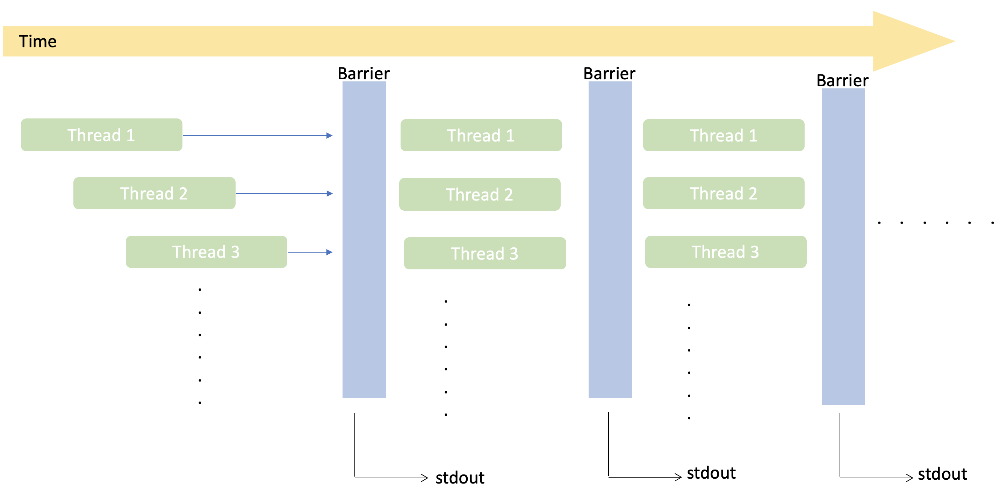

# Multi-thread-Sorting

Using pthread to sort a input list.

## Threads

Number of threads is depend on length of the input, length N. N/2 threads will be create. Two operations - compare and swap elements are done within thread. In each stage and each phases, every thread compares and swap a pair of elements if needed. All threads are design to do compare and swap in parallel.

All threads are start sequentially in a loop, arguments of thread function is store in another list. Index of number to compare is calculate by the thread index. At the end of each phase a there is a thread barrier waiting on all thread that has being established to finish so that all threads has the same starting point at the beginning of next phase.  




## Input file
Every line contain only one number. The first number is the length of the list to be sort.

To compile:
```
make gen
```

Input can be any integer. It will generate a file contain a list of integer with length 2 to the power of input.

## Reference

[1] Little book of semaphores, By Allen B. Downey, version 2.1.1

